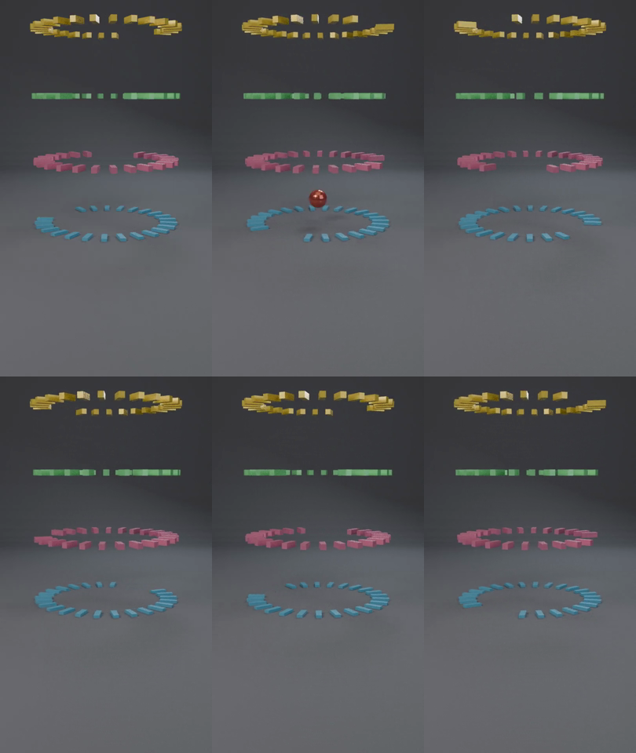
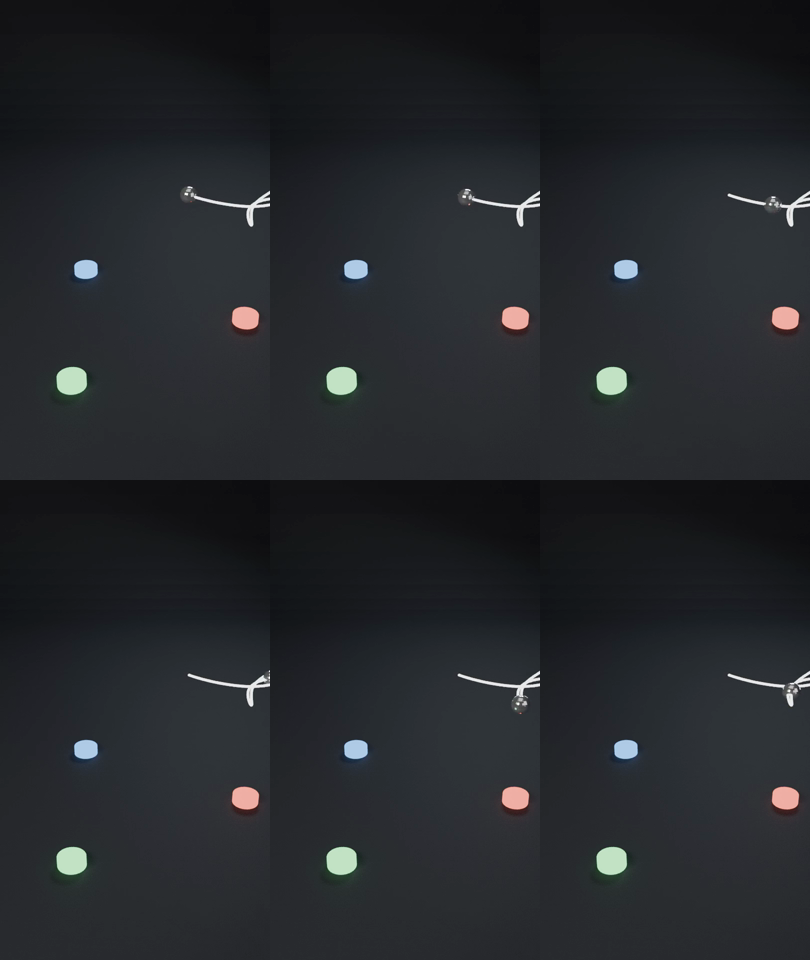
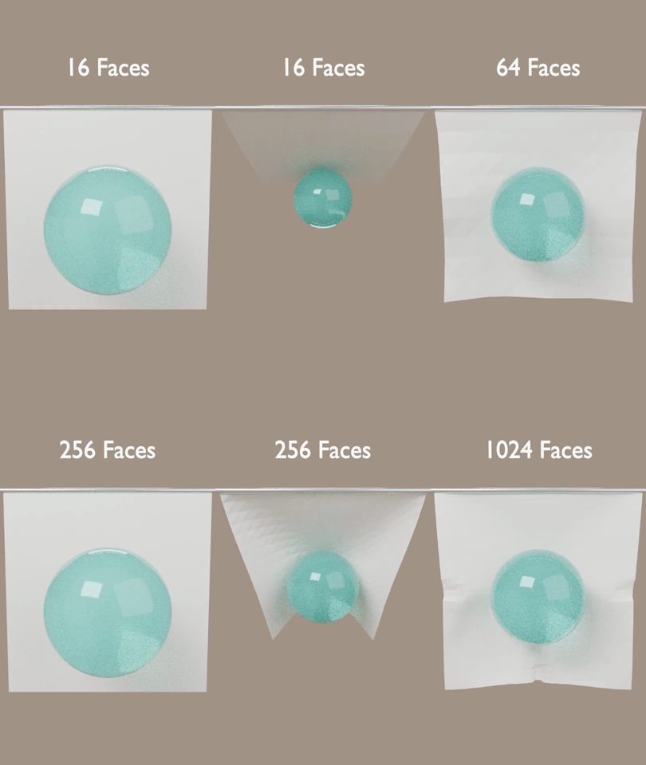
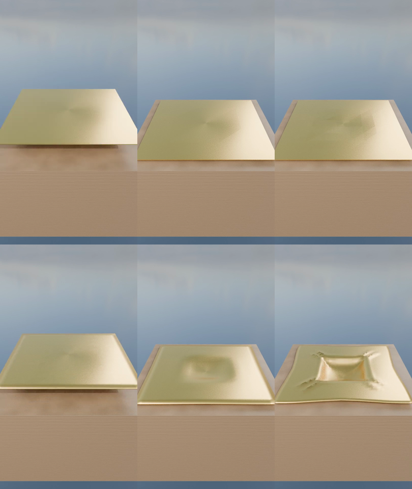

# Phase 1 — 画づくり判定シート（Gate 1→2）

`sim.yml` の preview レンダーから集めたコンタクトシート。
等間隔6フレームを 3x2 で並べたもの。判定基準は
`docs/production-plan.md` の Gate 1→2 の5項目。

> mp4 は Actions の `sim-<slug>` アーティファクトから取得する
> （`outputs/` は意図的に gitignore なので動画はコミットしない）。

生成: `gate-review` workflow — 2026-08-01 05:19 UTC

## `marble_elimination_race`

_コンタクトシートなし（レンダー失敗）_

## `press_crush_showdown`

_コンタクトシートなし（レンダー失敗）_

## `glass_fracture_wall`

_コンタクトシートなし（レンダー失敗）_

## `soft_body_torus_compare`

_コンタクトシートなし（レンダー失敗）_

## `growing_ball_bounce`

_コンタクトシートなし（レンダー失敗）_

## `pyramid_collapse_100`

_コンタクトシートなし（レンダー失敗）_

## `funnel_vortex_marbles`

_コンタクトシートなし（レンダー失敗）_

## `double_spiral_domino`

_コンタクトシートなし（レンダー失敗）_

## `sand_avalanche_asmr`

_コンタクトシートなし（レンダー失敗）_

## `ring_escape_tall`

_コンタクトシートなし（レンダー失敗）_

## `ring_escape_5rings`



```
CHAOSIM_MAX_FRAMES=180: truncating frame_end 360 -> 180
Engine=CYCLES frames=1-180 res%=50 fps=30
Render complete: /home/runner/work/chaosim/chaosim/outputs/renders/ring_escape_5rings.mp4
```

## `magnetic_pendulum_ufo`



```
CHAOSIM_MAX_FRAMES=180: truncating frame_end 450 -> 180
Engine=CYCLES frames=1-180 res%=50 fps=30
Render complete: /home/runner/work/chaosim/chaosim/outputs/renders/magnetic_pendulum_ufo.mp4
```

## `paper_to_cloth`



```
CHAOSIM_MAX_FRAMES=180: truncating frame_end 720 -> 180
Engine=CYCLES frames=1-180 res%=50 fps=30
CHAOSIM_MAX_FRAMES=180: stage_duration_sec -> 1.500s x 4 stages
Staged frame_end override -> 180
Render complete: /home/runner/work/chaosim/chaosim/outputs/renders/paper_to_cloth.mp4
```

## `cloth_by_faces`



```
CHAOSIM_MAX_FRAMES=180: truncating frame_end 600 -> 180
Engine=CYCLES frames=1-180 res%=50 fps=30
CHAOSIM_MAX_FRAMES=180: stage_duration_sec -> 1.500s x 4 stages
Staged frame_end override -> 180
Render complete: /home/runner/work/chaosim/chaosim/outputs/renders/cloth_by_faces.mp4
```

