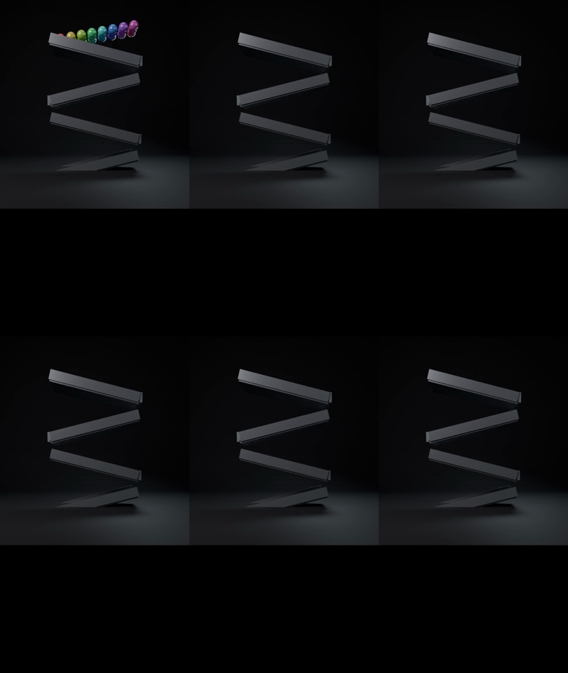
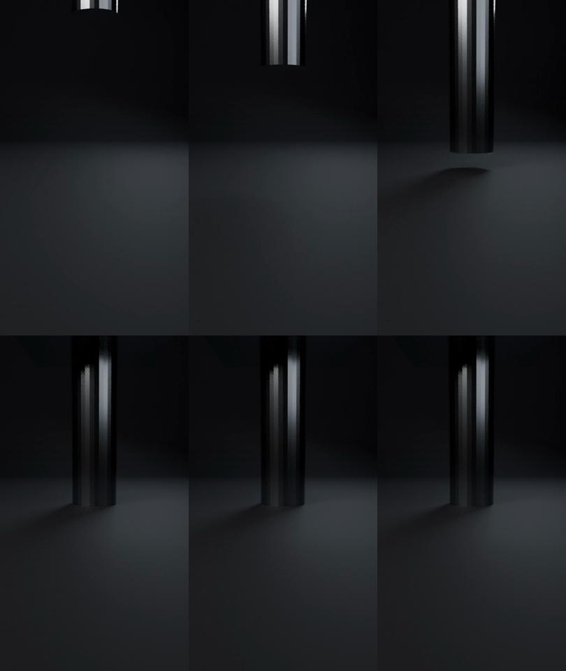
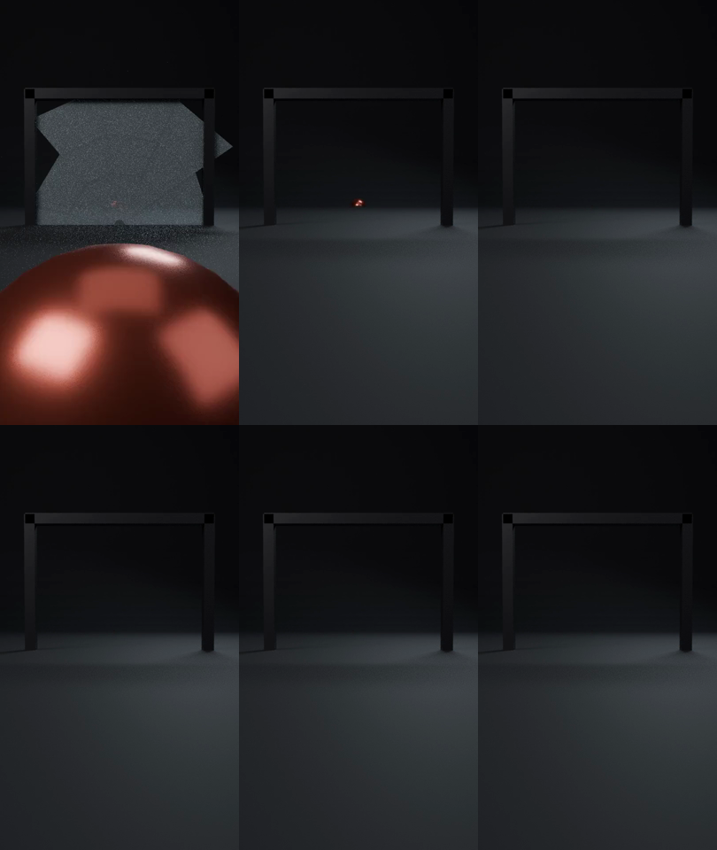
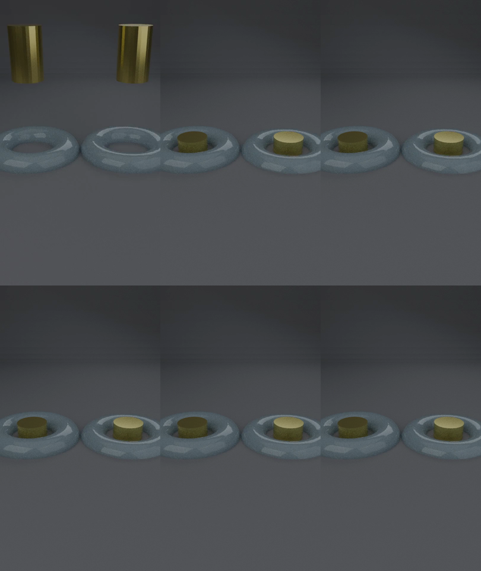
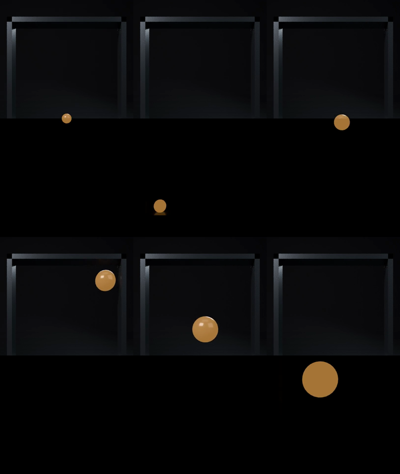
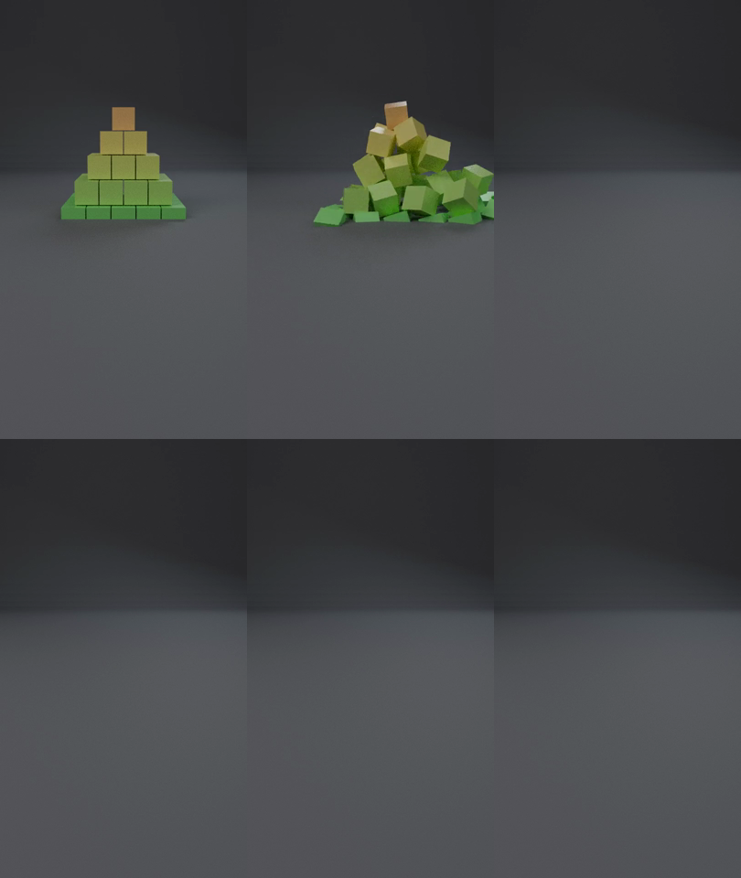
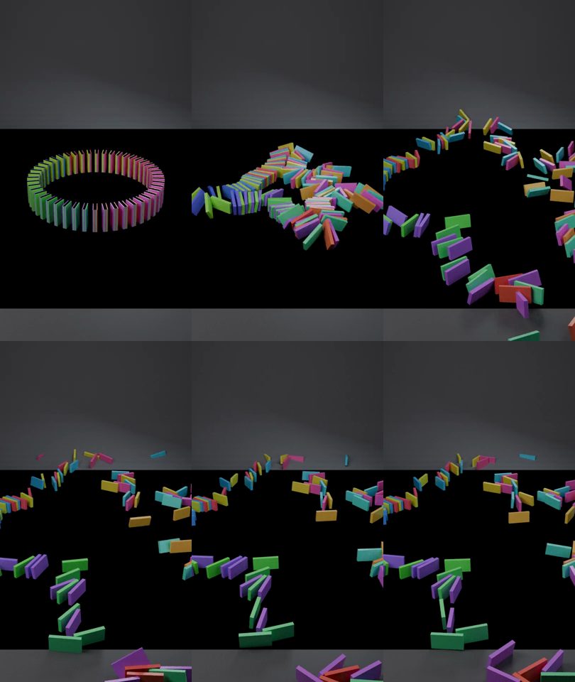
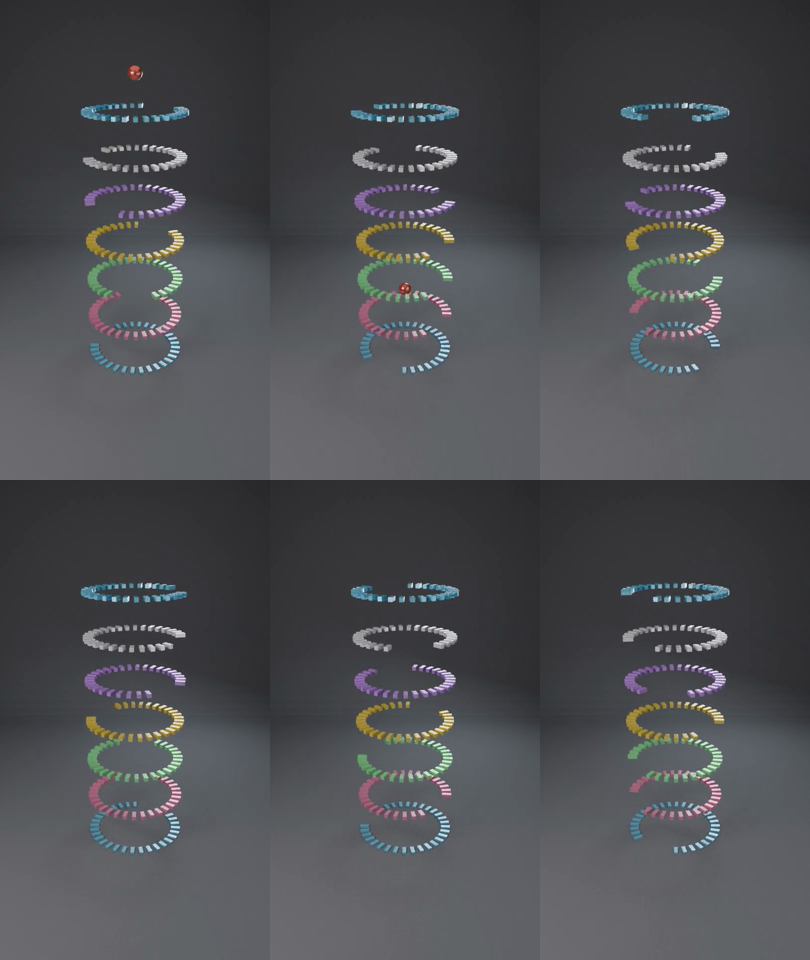

# Phase 1 — 画づくり判定シート（Gate 1→2）

`sim.yml` の preview レンダーから集めたコンタクトシート。
等間隔6フレームを 3x2 で並べたもの。判定基準は
`docs/production-plan.md` の Gate 1→2 の5項目。

> mp4 は Actions の `sim-<slug>` アーティファクトから取得する
> （`outputs/` は意図的に gitignore なので動画はコミットしない）。

生成: `gate-review` workflow — 2026-08-01 06:45 UTC

## `marble_elimination_race`



```
CHAOSIM_MAX_FRAMES=180: truncating frame_end 540 -> 180
Engine=CYCLES frames=1-180 res%=50 fps=30
Wrote 0 SFX events -> /home/runner/work/chaosim/chaosim/outputs/renders/marble_elimination_race_events.json
Render complete: /home/runner/work/chaosim/chaosim/outputs/renders/marble_elimination_race.mp4
```

## `press_crush_showdown`



```
CHAOSIM_MAX_FRAMES=180: truncating frame_end 450 -> 180
Engine=CYCLES frames=1-180 res%=50 fps=30
Wrote 3 SFX events -> /home/runner/work/chaosim/chaosim/outputs/renders/press_crush_showdown_events.json
Render complete: /home/runner/work/chaosim/chaosim/outputs/renders/press_crush_showdown.mp4
```

## `glass_fracture_wall`



```
CHAOSIM_MAX_FRAMES=180: truncating frame_end 300 -> 180
Engine=CYCLES frames=1-180 res%=50 fps=30
Wrote 4 SFX events -> /home/runner/work/chaosim/chaosim/outputs/renders/glass_fracture_wall_events.json
Render complete: /home/runner/work/chaosim/chaosim/outputs/renders/glass_fracture_wall.mp4
```

## `soft_body_torus_compare`



```
CHAOSIM_MAX_FRAMES=180: truncating frame_end 360 -> 180
Engine=CYCLES frames=1-180 res%=50 fps=30
Wrote 2 SFX events -> /home/runner/work/chaosim/chaosim/outputs/renders/soft_body_torus_compare_events.json
Render complete: /home/runner/work/chaosim/chaosim/outputs/renders/soft_body_torus_compare.mp4
```

## `growing_ball_bounce`



```
CHAOSIM_MAX_FRAMES=180: truncating frame_end 600 -> 180
Engine=CYCLES frames=1-180 res%=50 fps=30
Wrote 17 SFX events -> /home/runner/work/chaosim/chaosim/outputs/renders/growing_ball_bounce_events.json
Render complete: /home/runner/work/chaosim/chaosim/outputs/renders/growing_ball_bounce.mp4
```

## `pyramid_collapse_100`



```
CHAOSIM_MAX_FRAMES=180: truncating frame_end 450 -> 180
Engine=CYCLES frames=1-180 res%=50 fps=30
Wrote 9 SFX events -> /home/runner/work/chaosim/chaosim/outputs/renders/pyramid_collapse_100_events.json
Render complete: /home/runner/work/chaosim/chaosim/outputs/renders/pyramid_collapse_100.mp4
```

## `double_spiral_domino`



```
CHAOSIM_MAX_FRAMES=180: truncating frame_end 540 -> 180
Engine=CYCLES frames=1-180 res%=50 fps=30
Wrote 20 SFX events -> /home/runner/work/chaosim/chaosim/outputs/renders/double_spiral_domino_events.json
Render complete: /home/runner/work/chaosim/chaosim/outputs/renders/double_spiral_domino.mp4
```

## `ring_escape_tall`



```
CHAOSIM_MAX_FRAMES=180: truncating frame_end 420 -> 180
Engine=CYCLES frames=1-180 res%=50 fps=30
Wrote 7 SFX events -> /home/runner/work/chaosim/chaosim/outputs/renders/ring_escape_tall_events.json
Render complete: /home/runner/work/chaosim/chaosim/outputs/renders/ring_escape_tall.mp4
```

